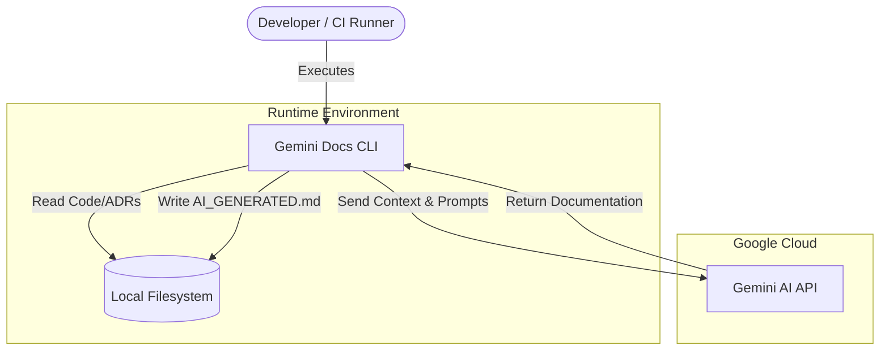

# Gemini Docs

## 🏗️ Architecture (C4 Model)

## 🔌 Integrations & Data Flow

| Direction | System/Service | Protocol | Purpose | Auth Method |
|--|--|--|--|--|
| **Downstream** | Google Gemini API | HTTPS | LLM content generation | API Key |
| **Internal** | Filesystem | OS I/O | Reads source code & ADRs | N/A |
| **Internal** | Filesystem | OS I/O | Writes Markdown docs | N/A |

## ⚙️ Key Configuration & Behavior

| Environment Variable / Flag | Description | Criticality |
|--|--|--|
| `GEMINI_API_KEY` | Key for Google GenAI authentication | High |
| `-path` / `target_dir` | Target directory for code scanning | Medium |
| `-model` / `model` | Specific Gemini model version to invoke | Low |

## 🔒 Security Posture
- **Authentication**: Uses `GEMINI_API_KEY` environment variable for Google GenAI client initialization.
- **Authorization**: N/A (Local CLI tool).
- **Data Privacy**: **High Risk.** The tool sends raw source code and design records to an external LLM (Google Gemini). Ensure no secrets or sensitive PII are committed to the scanned files.
- **Scanning**: Automatically respects `.gitignore` and hardcoded exclusions (`.git`, `node_modules`, `vendor`) to prevent accidental leakage of dependency code or metadata.

## 💰 FinOps Observations
- **Token Costs**: Gemini API pricing is usage-based (per token). Large repositories with extensive source code will increase prompt size and operational costs.
- **Model Selection**: The default `gemini-3-flash-preview` is typically more cost-effective than "Pro" variants but should be monitored for performance/cost balance.