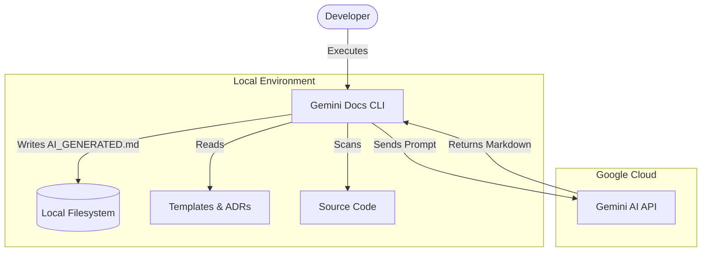

# Gemini Docs CLI

## 🏗️ Architecture (C4 Model)
The Gemini Docs CLI is a standalone Go application that orchestrates data collection from the local filesystem to generate documentation via Google's Gemini AI.

## 🔌 Integrations & Data Flow
The application acts as a bridge between the local source code and the Google Gemini LLM.

| Direction | System/Service | Protocol | Purpose | Auth Method |
|--|--|--|--|--|
| **Downstream** | Google Gemini API | HTTPS/gRPC | Content generation | API Key |
| **Internal** | Local Filesystem | OS/IO | Reads code, ADRs, templates | N/A |
| **Internal** | Local Filesystem | OS/IO | Writes documentation | N/A |

## ⚙️ Key Configuration & Behavior
Configuration is handled via CLI flags and environment variables.

| Variable / Flag | Description | Criticality |
|--|--|--|
| `GEMINI_API_KEY` | API key for Google AI SDK (Env Var) | High |
| `-model` | Specific Gemini model (default: gemini-3-flash-preview) | Medium |
| `-path` | Target directory for scanning source code | High |

### 💰 FinOps Notes
- **Token Usage**: The tool sends the entire codebase (filtered by extension) and all ADRs in a single prompt. For large repositories, this can result in high token consumption.
- **Model Choice**: Using "Flash" models is recommended to keep costs low compared to "Pro" models.

## 🔒 Security Posture
- **Authentication**: Uses a `GEMINI_API_KEY` passed via environment variables.
- **Authorization**: N/A (Local CLI).
- **Data Privacy**: **High Risk.** This tool sends raw source code to Google's Gemini API. Ensure that corporate policies allow sending proprietary code to 3rd-party LLM providers.
- **Hardcoded Exclusions**: The tool automatically ignores `.git`, `node_modules`, and `vendor` directories to prevent accidental leakage of dependency code or secrets stored in Git history.
- **Input Validation**: The `-path` flag accepts local paths; ensure the execution environment has restricted filesystem permissions to prevent unauthorized file reads.